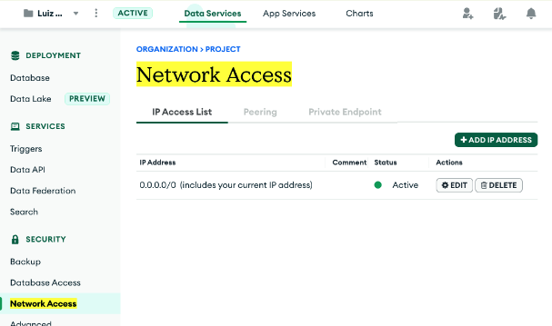
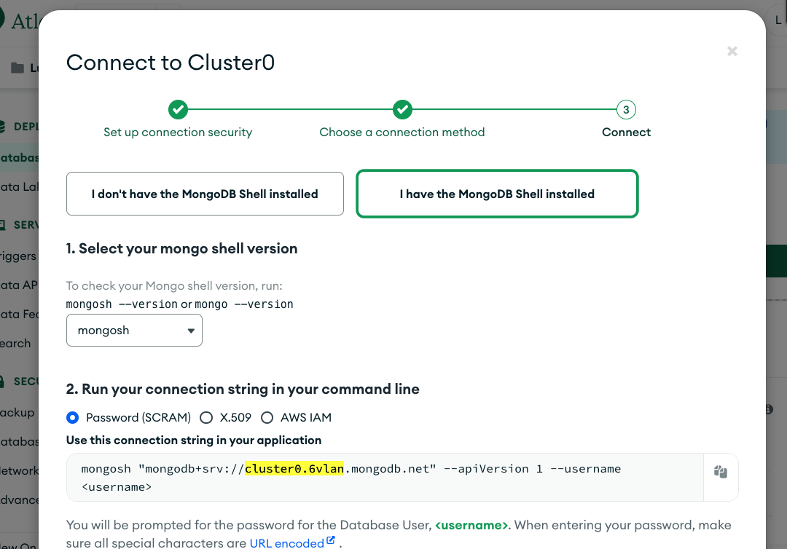

# ETL with MongoDB Atlas and AWS Glue Studio (through Pyspark scripts)

## Introduction
The amount of information is growing minute by minute and storing the volumes of data is paramount for any analytics or business intelligence. Enterprises are now generating the DataLake to consolidate all their federated data to a single location.

The ETL (Extract Transform and Load) process is key functionality to having a well-structured process for the data lake.

AWS provides various services for data transfer and AWS Glue is the prime service for their ETL offering. AWS Glue studio is also made available to have a graphical user interface to ease the ETL process.

In this document, we will demonstrate how to integrate MongoDB Atlas with the AWS Glue services. We will show a practical guide for loading the data from S3 through AWS Glue Crawler, Mapping, and Data Catalog services to MongoDB Atlas.

This can be extended to any of the source connectors of AWS GLue like CSV, XLS, Text, RDBMS, Stream data, etc.

This article is to demonstrate the capabilities of MongoDB Atlas and AWS Glue Studio Integration.

## MongoDB Atlas

[MongoDB Atlas](https://www.mongodb.com/atlas) is an all-purpose database having features like Document Model, Geo-spatial, Time Series, hybrid deployment, and multi-cloud services. It evolved as a "Developer Data Platform", intended to reduce the developer's workload on the development and management of the database environment. It also provides a free tier to test out the application/database features.

## AWS Glue Studio
[AWS Glue Studio](https://docs.aws.amazon.com/glue/latest/ug/what-is-glue-studio.html) is a new graphical interface that makes it easy to create, run, and monitor extract, transform, and load (ETL) jobs in AWS Glue. You can visually compose data transformation workflows and seamlessly run them on AWS Glue’s Apache Spark-based serverless ETL engine. You can inspect the schema and data results in each step of the job.

## Integration Features

With AWS Glue Studio, we can now create scripts for integrations with all the data sources. In this module, we utilized the MongoDB Atlas's Spark connectors to connect to the MongoDB Atlas.

## Reference Architecture 

## Prerequisite:

1. [AWS Account](https://aws.amazon.com/free/free-tier/)
2. MongoDB Atlas free cluster
3. [AWS CLI](https://docs.aws.amazon.com/cli/latest/userguide/getting-started-install.html)

## Steps for Integration

### 1. Set up the MongoDB Atlas cluster

Please follow the [link](https://www.mongodb.com/docs/atlas/tutorial/deploy-free-tier-cluster) to set up a free cluster in MongoDB Atlas

Configure the database for [network security](https://www.mongodb.com/docs/atlas/security/add-ip-address-to-list/) and [access](https://www.mongodb.com/docs/atlas/tutorial/create-mongodb-user-for-cluster/).

For this lab, configure the [network access](https://www.mongodb.com/docs/atlas/security/add-ip-address-to-list/) to allow connection from anywhere, as seen in the image bellow. This is a way of making sure that the Glue Job will be able to access your cluster:

ℹ️ _It is not advisable to use over-permissive network access in a real-world setting. The recommended connectivity option would be [AWS PrivateLink](https://www.mongodb.com/docs/atlas/security-private-endpoint/) or [VPC Peering](https://www.mongodb.com/docs/atlas/security-vpc-peering/) with proper network security polices. However, this is not covered in this lab._

### 2. Connect to the AWS CLI environment and Set up the AWS Secrets

[Connect to AWS CLI environment](https://docs.aws.amazon.com/polly/latest/dg/setup-aws-cli.html)

execute the below CLI command to create a secret and copy the ARN from the output.

	aws secretsmanager create-secret\
    	--name partner-gluejob-secrets-s3atlas\
    	--description "Secret for MongoDB Atlas"\
    	--secret-string "{\"USERNAME\":\"<enter the user name> \",\"PASSWORD\":\"<enter the password>\",\"SERVER_ADDR\":\"<enter the servername>\"}"

Note:
While providing the server address, provide only the server name.

You can find the server name in the connection string. To view the connection string you can reach for the "Connect" button on your Atlas Cluster.

Example provide below:

Server connection string: `"mongodb+srv://cluster0.vlan6.mongodb.net/?retryWrites=true&w=majority"`
SERVER_ADDR = `cluster0.vlan6`

### 3. Create the AWS IAM role to grant access to S3, Glueservice, Glueconsole, and Secrets

Refer to the screenshots below as reference.

Trust Policy

		{
		    "Version": "2012-10-17",
		    "Statement": [
			{
			    "Effect": "Allow",
			    "Principal": {
				"Service": "glue.amazonaws.com"
					 },
			    "Action": "sts:AssumeRole"
			}
				]
		}

In-line policy to grant access to the AWS Secrets, using the ARN copied in the above step2

			{
			    "Version": "2012-10-17",
			    "Statement": {
				"Effect": "Allow",
				"Action": "secretsmanager:GetSecretValue",
				"Resource": "<ARN for AWS Secret>"
			    }
			}

### 4. Upload the sample JSON file to S3 bucket

Upload the sample [airport.json](https://github.com/mongodb-partners/S3toAtlas/blob/main/code/airports.json) file to the S3 bucket

### 5. Create a Glue Studio Job and run

Login to [AWS Console](https://aws.amazon.com/console/)

Search for AWS Glue Studio and select from the dropdown (Features --> AWS Glue Studio)

Click on the Job from the menu and select "Spark script editor"

Click "Create"

Copy the Code from the [link](https://github.com/mongodb-partners/S3toAtlas/blob/main/code/pyspark_s3toatlas.py) and paste

In the code, you'll find the S3 bucket details (#ds), MongoDB Atlas Connection  (#mongo_uri), database, collection, username and password details. The Job Parameters (see below) will be used to populate these variables. But you can also choose to change the variables as seen below:

Configure the parameters in the "Job details" tab

Update the following parameters:

a. Name

b. IAM Role (with the previously created role)

c. Job Parameter

You can keep the default values for all other parameters.

### Job Parameter

		--BUCKET_NAME <name of the bucket you placed the airports.json file into e.g. my-bucket>
		--COLLECTION_NAME <choose a name you would like for your collection in your MongoDB cluster e.g. s3collection>
		--DATABASE_NAME <choose a name you would like for your database in your MongoDB cluster e.g. s3db>
		--INPUT_FILENAME <the name of the source data file you placed in S3 e.g. airports.json>
		--PREFIX <choose a name you would like for your prefix e.g. toatlas>
		--REGION_NAME <the region you have used for your secret e.g. eu-west-1>
		--SECRET_NAME <the name you set for your secret e.g. partner-gluejob-secrets-s3atlas>

Save the job and click "Run" on the top right.

Click on the "Runs" tab and ensure the job ran successfully. You can refer to the logs in the "Runs" tab for troubleshooting

### 6. Validate the Data in MongoDB Atlas

Validate the S3 data are created as a document in MongoDB Atlas

## Troubleshoot

If you are using Glue version 3.0, the connection string to changed from "connection.uri" --> "uri"

If you are using Glue version 4.0, the connection string to changed from "uri" --> "connection.uri"

## Summary

The above steps demonstrate the movement of data from the S3 bucket to MongoDB Atlas. The same steps can be used to move data from MongoDB Atlas to S3 bucket using the [code](https://github.com/mongodb-partners/S3toAtlas/blob/main/code/pyspark_atlastos3.py).

Hope this technical guide helped you move the data from and to the MongoDB Atlas cluster using the AWS Glue Studio.

This solution can be extended to other data sources through AWS Glue Studio - Catalog service. Refer [link](https://github.com/Babusrinivasan76/atlasgluestudiointegration).

For any assistance please reach out to partners@mongodb.com
